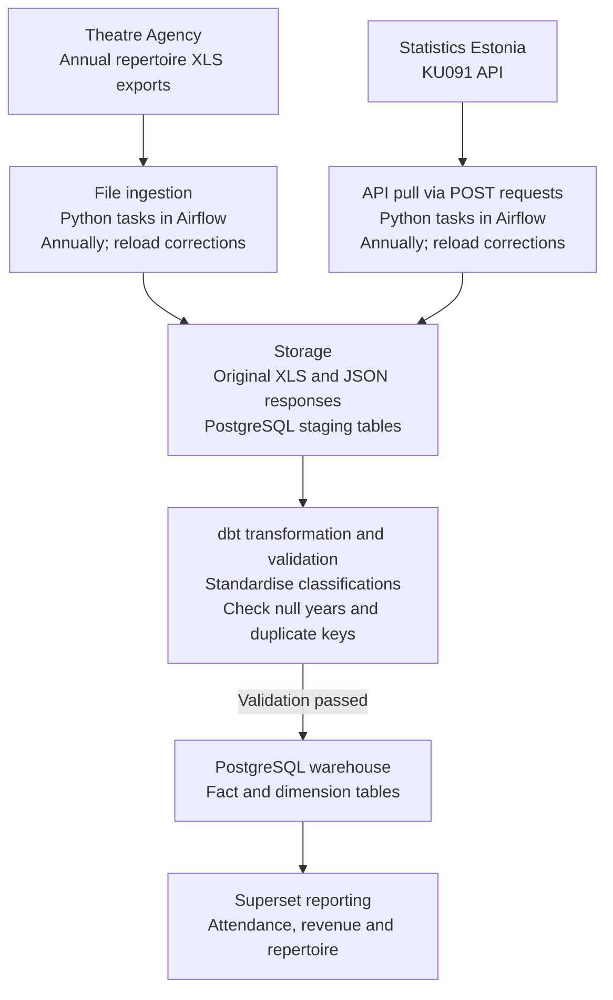

# Trends in Estonian Theatres
LTAT.02.007 Data Engineering course project

## Business Brief
The goal of this project is to design a data architecture and dimensional model for analysing attendance, ticket revenue and repertoire trends in Estonian theatres

The intended **stakeholders** are
* theatre managers and repertoire planners (to compare attendance and revenue across productions, genres and target audiences);
* cultural policymakers (to examine changes in theatre activity and audience reach);
* theatre analysts and researchers (to explore long-term patterns using consistent definitions and comparable measures).

**Key Performance Indicators**:
* Total attendance: the sum of reported in-person visits within the selected scope.
* Attendance per performance: total in-person visits divided by total performances.
* Ticket revenue per performance: total reported ticket revenue divided by total performances.

**Business questions**:
1. Which production genres account for the highest attendance and ticket revenue?
2. Which productions have the highest attendance per performance?
3. How do annual attendance and ticket revenue trends differ between theatres?
4. How does ticket revenue per performance differ between productions aimed at children, young people and adults?
5. How do productions based on Estonian and foreign texts differ in attendance per performance?
6. How does the distribution of attendance across production types in individual theatres compare with the national distribution in the same year?

## Datasets

The project focuses on annual theatre activity. It combines the Estonian Theatre Agency’s [repertoire statistics](https://teater.ee/teatristatistika/sisukord/) with Statistics Estonia’s [KU091 table](https://andmed.stat.ee/en/stat/sotsiaalelu__kultuur__teater/KU091), which provides aggregated statistics by production type or genre.

The repertoire [dataset](https://statistika.teater.ee/stat/stat_filter/show/repertoireConsolidatedList) contains annual records for individual productions within each theatre. Its 14 source columns include the theatre, author, country of origin of the text, production title, production type, genre, premiere date, target audience, permanent venue, number of performances, ticket revenue, in-person attendance and online attendance. Data will be collected through XLS exports for multiple years, with the reporting year added to each record. This dataset supports comparisons between theatres and productions.

KU091 provides national aggregates rather than records for individual theatres. Its dimensions are year, theatre category and production type or genre, with seven statistical indicators. The table currently offers 18 years, three theatre categories and 31 production-type or genre entries. Data will be retrieved through Statistics Estonia's API. 

The datasets will be compared using aligned years, theatre categories and production classifications. Production-level records will first be aggregated to the corresponding level in KU091. Total categories and their constituent categories will be kept separate to prevent double counting. As the datasets contain annual aggregates, they support annual trend analysis rather than analysis of individual performances or ticket transactions.

## Tooling

The proposed implementation would use the following tools covered in the course:
* **Docker** would provide a reproducible environment for running the database, orchestration and reporting services.
* **Apache Airflow** would orchestrate batch ingestion from repertoire XLS files and the Statistics Estonia API, followed by transformation and validation tasks. Refreshes would follow the sources' annual publication cycle, with additional runs for revised data.
* **PostgreSQL** would store ingested records in staging tables and the analytical fact and dimension tables in a separate warehouse schema.
* **dbt** would perform SQL-based transformations, standardise classifications and build the dimensional model. Data quality tests would check required fields, key uniqueness and relationships between fact and dimension tables.
* **Apache Superset** would query the warehouse and provide dashboards for attendance, ticket revenue and repertoire trends.
\end{itemize}

Supporting Python scripts would retrieve API responses and read XLS files. Original source files and responses would be retained for traceability and reprocessing. This project specifies the tools and their intended roles; implementation is planned for the next project.

## Data Architecture

The architecture follows a batch ELT approach. Python ingestion tasks orchestrated by Airflow would load the Theatre Agency's XLS exports and retrieve KU091 data through API requests. Original files and API responses would be retained in raw storage, while extracted records would be loaded into PostgreSQL staging tables.

dbt would standardise classifications, validate records and populate the warehouse's fact and dimension tables. Superset would query the warehouse for reporting. Data would be refreshed annually following source publication, with additional runs for corrections. Validation would include non-null reporting years, uniqueness of the theatre--production--year key in the repertoire dataset, and checks for unmatched classification codes. Failed checks would flag affected records for review before publication.

\includegraphics[width=0.5\textwidth]{mermaid-diagram.png}

Figure 1. Proposed batch data architecture for integrating production-level repertoire statistics and national theatre aggregates.

## Data Model

The model consists of two star schemas sharing year, theatre category and production classification dimensions. Surrogate keys identify dimension records, and foreign keys connect them to the fact tables.

**Fact tables**
* **FactRepertoire**: one row per theatre, production and reporting year. Measures are performance count, in-person attendance, online attendance and ticket revenue. Foreign keys reference DimYear, DimTheatre, DimProduction, DimClassification, DimAudience and DimTheatreCategory.
* **FactNational**: one row per reporting year, theatre category and KU091 production-type or genre entry. Measures used for comparison are performance count and attendance. Foreign keys reference DimYear, DimTheatreCategory and DimClassification.

**Dimensions and SCD choices**
* **DimYear -- Static**: contains the reporting year. Calendar-year attributes do not change.
* **DimTheatre -- Type 2**: contains theatre identity, name and ownership form. Changes create a new version with validity years, preserving the theatre's attributes as reported for each year.
* **DimProduction -- Type 1**: contains production identity, title, author, text origin and premiere date. Descriptive corrections overwrite existing values; a distinct staging of the same work receives a separate production identity.
* **DimClassification -- Type 1**: contains production-type and genre codes, labels, reporting level and parent classification. Label corrections overwrite existing values. A change in a category's meaning receives a new identity.
* **DimAudience -- Static**: contains fixed target-audience categories. Changes in a production's target audience are represented by the audience key on its annual fact record.
* **DimTheatreCategory -- Static**: contains the fixed theatre-group categories used for national comparisons. Each repertoire record is assigned to the applicable category for its reporting year.

National observations are compared with repertoire records aggregated to the same year, theatre category and classification level. Parent totals and constituent genres are never summed together. Facts are aggregated separately before comparison to avoid multiplying national totals across production records. Ratios are calculated from summed measures.

## Data Dictionary

The following dictionary defines the proposed warehouse tables. Dimension keys are integer surrogate keys. Fact-table foreign keys reference the corresponding dimensions. Missing measures remain NULL; zero is used only when explicitly reported by the source. Attendance is normalised to visits, and monetary values to euros.

**FactRepertoire** stores annual performance, attendance and revenue measures for each theatre and production.

| Column | Data type | Description |
|---|---|---|
| `repertoire_key` | `BIGINT` | Primary key identifying the fact record. |
| `year_key` | `INTEGER` | Foreign key to `DimYear`; reporting year. |
| `theatre_key` | `INTEGER` | Foreign key to the `DimTheatre` version valid in the reporting year. |
| `production_key` | `INTEGER` | Foreign key to `DimProduction`. |
| `classification_key` | `INTEGER` | Foreign key to `DimClassification`; reported production type or genre. |
| `audience_key` | `INTEGER` | Foreign key to `DimAudience`; reported target audience. |
| `theatre_category_key` | `INTEGER` | Foreign key to `DimTheatreCategory`; category applicable in the reporting year. |
| `performance_count` | `INTEGER` | Number of performances during the reporting year. |
| `attendance` | `BIGINT` | Number of reported in-person visits. |
| `online_attendance` | `BIGINT` | Number of reported online visits. |
| `ticket_revenue_eur` | `NUMERIC(16,2)` | Reported annual ticket revenue in euros. |

The combination of year\_key, theatre\_key and production\_key must be unique.

**FactNational** stores KU091 aggregates for each reporting year, theatre category and classification entry.

| Column | Data type | Description |
|---|---|---|
| `national_key` | `BIGINT` | Primary key identifying the fact record. |
| `year_key` | `INTEGER` | Foreign key to `DimYear`; reporting year. |
| `theatre_category_key` | `INTEGER` | Foreign key to `DimTheatreCategory`. |
| `classification_key` | `INTEGER` | Foreign key to `DimClassification`; KU091 production-type, genre or total entry. |
| `performance_count` | `INTEGER` | Reported aggregate number of performances. |
| `attendance` | `BIGINT` | Reported aggregate attendance, converted from the source unit to visits. |

The combination of year\_key, theatre\_category\_key and classification\_key must be unique. Parent totals and their constituent categories are queried separately.

**DimYear** identifies reporting years.

| Column | Data type | Description |
|---|---|---|
| `year_key` | `INTEGER` | Primary key. |
| `reporting_year` | `SMALLINT` | Calendar year represented by the fact record; unique. |

**DimTheatre** preserves annual versions of theatre attributes using SCD Type 2.

| Column | Data type | Description |
|---|---|---|
| `theatre_key` | `INTEGER` | Primary key identifying a theatre version. |
| `theatre_code` | `TEXT` | Stable canonical identifier shared by all versions of the same theatre. |
| `theatre_name` | `TEXT` | Theatre name applicable to this version. |
| `ownership_form` | `TEXT` | Reported ownership or organisational form. |
| `valid_from_year` | `SMALLINT` | First reporting year for which the version applies, inclusive. |
| `valid_to_year` | `SMALLINT` | First reporting year for which the version no longer applies, exclusive; `NULL` for the latest version. |
| `is_current` | `BOOLEAN` | Indicates whether this is the latest stored version. |

**DimProduction** describes individual stagings of theatrical works.

| Column | Data type | Description |
|---|---|---|
| `production_key` | `INTEGER` | Primary key. |
| `production_code` | `TEXT` | Unique canonical production identifier, mapped from source identifiers where available. |
| `production_title` | `TEXT` | Title of the production. |
| `author_credit` | `TEXT` | Author or dramatiser credit as reported; may contain multiple names. |
| `text_origin` | `TEXT` | Reported country or origin category of the text; may represent multiple countries. |
| `premiere_date` | `DATE` | Reported premiere date of this staging. |

Different stagings of the same work receive different production identifiers.

**DimClassification** aligns source production types and genres while retaining their reporting levels.

| Column | Data type | Description |
|---|---|---|
| `classification_key` | `INTEGER` | Primary key. |
| `classification_code` | `TEXT` | Unique canonical identifier for the classification entry. |
| `classification_name` | `TEXT` | Standardised label of the entry. |
| `reporting_level` | `TEXT` | Entry level: `type`, `genre` or `total`. |
| `production_type_code` | `TEXT` | Canonical code of the corresponding production type; `NULL` for an overall total. |
| `production_type_name` | `TEXT` | Label of the corresponding production type. |

Source labels and codes are mapped to these entries during transformation. Codes identify category meanings; materially different meanings receive separate identities.

**DimAudience** defines target-audience categories.

| Column | Data type | Description |
|---|---|---|
| `audience_key` | `INTEGER` | Primary key. |
| `audience_code` | `TEXT` | Unique canonical target-audience code. |
| `audience_name` | `TEXT` | Target-audience label. |
| `audience_description` | `TEXT` | Definition of the category, including source age boundaries where available. |

**DimTheatreCategory** defines theatre groups used for national comparisons.

| Column | Data type | Description |
|---|---|---|
| `theatre_category_key` | `INTEGER` | Primary key. |
| `category_code` | `TEXT` | Unique canonical theatre-category code. |
| `category_name` | `TEXT` | Standardised category label. |
| `category_description` | `TEXT` | Definition of which theatres the category includes. |

Category membership is assigned to annual repertoire facts. Aggregate categories may overlap with their constituent groups and must not be added together.

## Demo Queries

The following PostgreSQL queries address the business questions. Ratios use aggregated totals and protect against division by zero. Revenue calculations exclude records with missing revenue, so their denominators cover the same records as their numerators.

